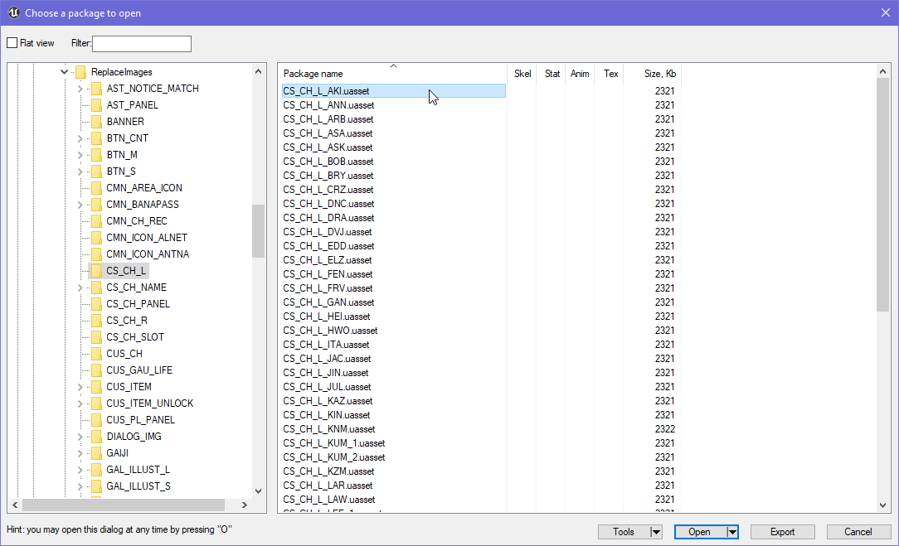
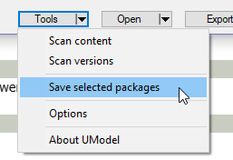
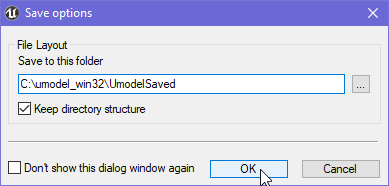
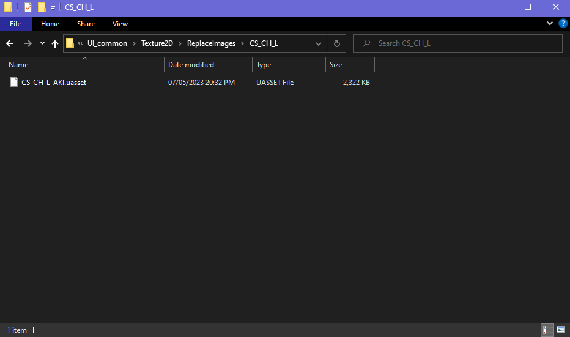

This documentation will describe how to extract .uasset files.

There are multiple ways to extract uasset files from Tekken 7, we'll go through every method of extracting files.

## Using umodel
Extracting files using umodel is simple, this method is ideal for when you don't have sufficent space on your computer to extract all of the game's files.

For this demonstration, we'll extract a simple UI texture file.

Begin by clicking on the asset you want to extract once, don't double click on it. Once the file is selected, click on the `Tools` button that is located at the bottom of umodel's window.

Click on `Save selected packages`, a pop-up window will appear prompting you where to save the file to.

Click on `OK` and navigate to the path.

You will see the uasset file.

## Using quickbms
QuickBMS is a tool that can extract files from various video game archives.

You can acquire the relevant files for extracting .pak files with QuickBMS by [clicking here](quickbms.zip).

Extract the contents of the zip file to an empty directory like `C:\quickbms`.
Then, locate Tekken 7's game files, they are located in `C:\Program Files (x86)\Steam\steamapps\common\TEKKEN 7\TekkenGame\Content\Paks` by default.

Copy the .pak files from the game's directory to the directory where you extracted QuickBMS.

After that, run `extract-all_4gb_files.bat`, a command-line window will appear. QuickBMS will start extracting the contents of the pak files to a directory called "out" in the QuickBMS directory.